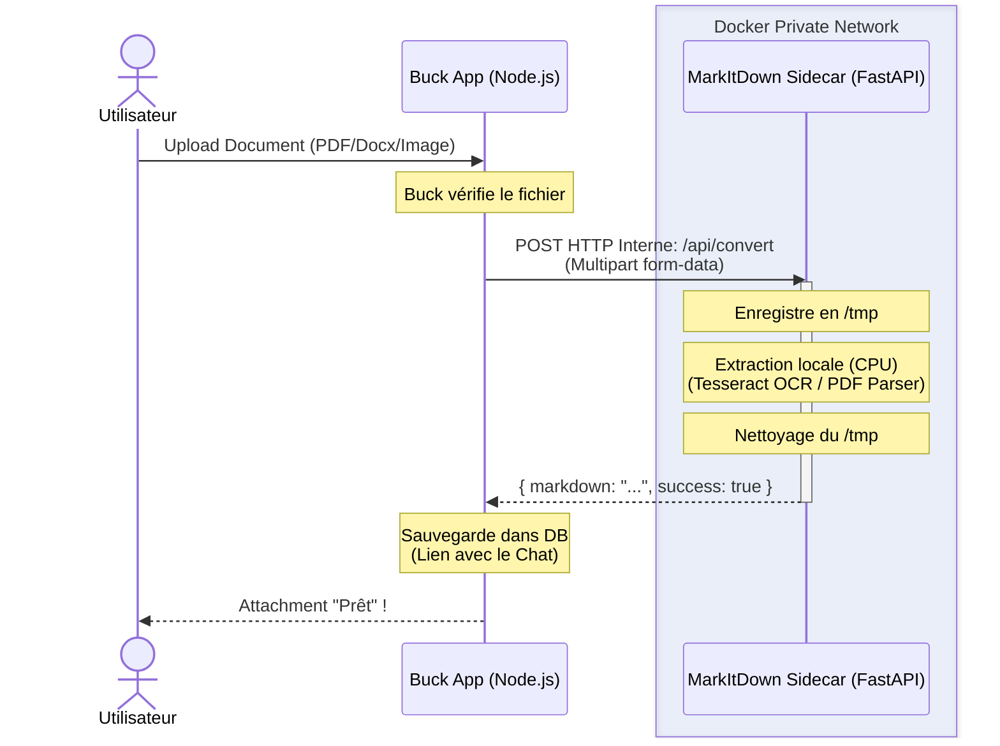

# Architecture : Intégration de MarkItDown pour Buck (100% Local & Sans Token)

## 1. As-Is (Open-Source) vs Optimisé pour le Use Case (Buck)

**Recommandation claire : Il faut créer une image custom (encapsulation optimisée) plutôt que d'utiliser l'outil brut.**

Bien que le projet Microsoft MarkItDown soit excellent, l'utiliser "tel quel" n'est pas adapté pour un environnement de production multi-utilisateurs sur un VPS.

Voici pourquoi une **encapsulation via FastAPI (Sidecar optimisé)** est bien plus performante pour Buck :

### A. Zéro Consommation de Tokens (100% Local)
Le but du jeu est de ne pas gaspiller de tokens (API LLM) pour de la simple extraction de texte. L'image open-source de MarkItDown embarque des dépendances pour se lier à des LLMs (OpenAI, Bing).
- **En mode custom** : Nous avons purgé toute la logique LLM du code et des dépendances. Le sidecar fonctionne à 100% sur le CPU du VPS en utilisant des outils natifs (OCR avec Tesseract pour les images, extraction directe pour les PDF/Word).
- **Bénéfice Buck** : Extraction totalement gratuite. Pas de fuite de tokens, indépendance totale vis-à-vis d'APIs externes.

### B. Contrôle des Ressources (Vital sur un VPS)
L'extraction de gros PDF ou l'OCR sur des images HD peut créer des pics énormes d'utilisation CPU et RAM.
- **En mode custom** : Le code FastAPI gère proprement les requêtes et le nettoyage des fichiers temporaires. Le `docker-compose` bride la RAM et le CPU.
- **Bénéfice Buck** : Ton VPS ne crashera pas (Out-Of-Memory) si un utilisateur envoie un PDF de 500 pages.

### C. Réduction drastique du poids de l'image
Le repo open-source recommande d'installer de lourdes dépendances système (`ffmpeg` pour l'audio, LibreOffice).
- **En mode custom** : Si Buck n'a pas vocation à transcrire des fichiers `.wav` ou `.mp3` via MarkItDown, on retire `ffmpeg` de notre `Dockerfile`. Le build sera 2 fois plus léger et rapide.

### D. Interface Programmatique Propre
L'API Node.js de Buck a besoin de JSON structuré pour bien gérer les erreurs côté client. Une API FastAPI custom te permet de renvoyer un objet propre `{ success: true, markdown: "..." }` au lieu de parser laborieusement la sortie standard (stdout) d'un process CLI.

---

## 2. L'Architecture Bout en Bout

Voici comment les briques s'articulent sur ton serveur. Le réseau Docker garantit que le sidecar n'est jamais exposé à l'internet public et n'a même pas besoin d'accéder à internet pour fonctionner.



---

## 3. Le Déploiement : Docker-Compose

Voici à quoi ressemble la configuration optimisée pour ton VPS.

```yaml
version: '3.8'

services:
  # L'application principale (Buck)
  buck-app:
    build: .
    ports:
      - "3000:3000"
    environment:
      # L'application Node.js communique avec le nom de service Docker
      - DOCUMENT_PARSER_URL=http://markitdown-worker:8000
    depends_on:
      - markitdown-worker

  # Le Sidecar de parsing (Totalement isolé d'internet)
  markitdown-worker:
    build: ./services/markitdown-sidecar
    expose:
      - "8000" # Expose le port SEULEMENT au réseau docker interne
    restart: unless-stopped

    # CRITIQUE SUR UN VPS : Limiter les ressources
    deploy:
      resources:
        limits:
          cpus: '1.0'      # Empêche le worker de monopoliser tout le CPU du VPS
          memory: 1G       # OOM Killer tuera le conteneur s'il dépasse 1Go
```

---

## 4. Implémentation du Worker (FastAPI 100% Local)

Le code est épuré au maximum. Pas de dépendances LLM, juste l'extraction brute.

### Python (`main.py`)

```python
import os
import tempfile
import logging

from fastapi import FastAPI, UploadFile, File, HTTPException
from pydantic import BaseModel
from markitdown import MarkItDown

logging.basicConfig(level=logging.INFO)
logger = logging.getLogger("markitdown-sidecar")

app = FastAPI(title="MarkItDown API Sidecar")

# Initialisation unique du parseur (100% local)
md = MarkItDown()

class ConvertResponse(BaseModel):
    filename: str
    markdown: str
    success: bool

@app.post("/api/convert", response_model=ConvertResponse)
async def convert_file(file: UploadFile = File(...)):
    """Convertit un fichier en Markdown 100% en local."""
    logger.info(f"Début de conversion pour le fichier: {file.filename}")

    suffix = os.path.splitext(file.filename)[1]
    tmp_path = None

    try:
        with tempfile.NamedTemporaryFile(delete=False, suffix=suffix) as tmp:
            tmp.write(await file.read())
            tmp_path = tmp.name

        # Conversion 100% locale (OCR pour images, parsing pour PDF)
        result = md.convert(tmp_path)

        return ConvertResponse(
            filename=file.filename,
            markdown=result.text_content,
            success=True
        )
    except Exception as e:
        raise HTTPException(status_code=400, detail=f"Erreur de traitement: {str(e)}")
    finally:
        if tmp_path and os.path.exists(tmp_path):
            os.remove(tmp_path)
```

### Le Dockerfile

```dockerfile
FROM python:3.11-slim

# On installe UNIQUEMENT ce dont Buck a besoin pour l'OCR local
RUN apt-get update && apt-get install -y \
    tesseract-ocr \
    tesseract-ocr-fra \
    tesseract-ocr-eng \
    libmagic1 \
    && rm -rf /var/lib/apt/lists/*

WORKDIR /app
COPY requirements.txt .
RUN pip install --no-cache-dir -r requirements.txt

COPY main.py .

CMD ["uvicorn", "main:app", "--host", "0.0.0.0", "--port", "8000"]
```

## Conclusion

Cette approche garantit un pipeline de parsing **souverain, gratuit, et robuste**. Le VPS effectue l'extraction sur son propre CPU, sans gaspiller le moindre token chez un fournisseur LLM, et l'isolation via `docker-compose` protège l'application Buck des crashs liés à la manipulation de fichiers lourds.
